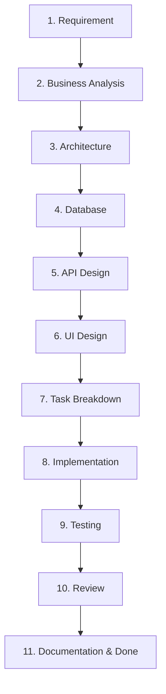

# RULE 02: WORKFLOW & PIPELINE ARCHITECTURE

> **NGUYÊN TẮC LUỒNG PIPELINE BẤT BIẾN**: Mọi tính năng (Feature) trong hệ thống Phụ Tùng Ô Tô Q.BA phải đi qua đúng đường ống Pipeline 11 bước tiêu chuẩn. Tuyệt đối KHÔNG ĐƯỢC NHẢY BƯỚC.

---

## 🔄 ĐƯỜNG ỐNG PIPELINE 11 BƯỚC CHUYỂN ĐỔI FEATURE

---

## 📝 CHI TIẾT NỘI DUNG 11 BƯỚC KỸ THUẬT

1. **Requirement (Yêu cầu)**: Tiếp nhận yêu cầu từ Chủ dự án, xác định phạm vi công việc.
2. **Business Analysis (Phân tích Nghiệp vụ)**: Phân tích luồng người dùng (User Flow), thực thể dữ liệu liên quan.
3. **Architecture (Kiến trúc)**: Đánh giá vị trí component/service trong tổng thể hệ thống Next.js App Router.
4. **Database (Cơ sở Dữ liệu)**: Xác định Model, Schema, thuộc tính và kiểu dữ liệu (nếu có).
5. **API Design (Thiết kế API)**: Định nghĩa hợp đồng RESTful API (Endpoint, Method, Status Code, Payload).
6. **UI Design (Thiết kế Giao diện)**: Định hình Wireframe, Component Layout, Responsive Breakpoints & Design Tokens.
7. **Task Breakdown (Chia Task)**: Chia nhỏ công việc thành các task nhỏ (<= 300 dòng code, <= 4 giờ làm).
8. **Implementation (Viết mã)**: Lập trình mã nguồn tuân thủ Clean Code & SOLID.
9. **Testing (Tự kiểm thử)**: Chạy `npm run build`, Type-check, kiểm tra Responsive & Edge cases.
10. **Review (Tự đánh giá)**: Đánh giá chất lượng mã nguồn theo 12 tiêu chí Self-Review.
11. **Documentation & Done (Tài liệu & Hoàn thành)**: Cập nhật nhật ký `ai-journal.md`, `current-state.md` và `changelog.md`.
