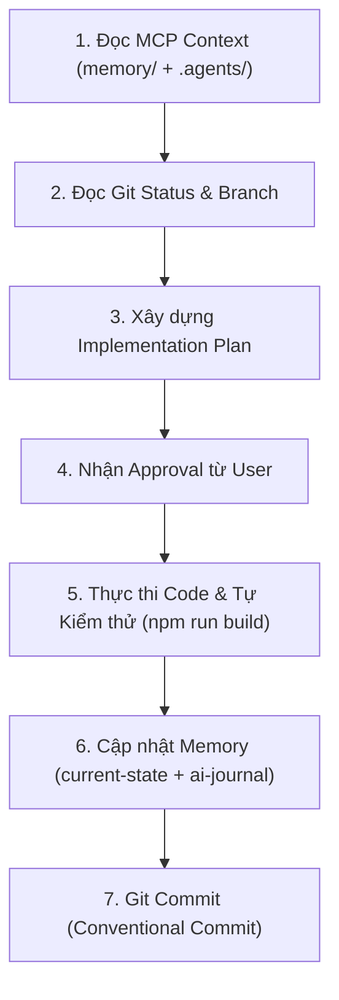

# RULE 07: MODEL CONTEXT PROTOCOL (MCP) & AI WORKFLOW INTEGRATION

> **NGUYÊN TẮC QUẢN LÝ NGỮ CẢNH (CONTEXT INTEGRITY)**: AI Agent vận hành dựa trên giao thức MCP để kết nối bộ nhớ (`memory/`), lịch sử Git repository và môi trường thực thi của dự án Phụ Tùng Ô Tô Q.BA.

---

## 🔗 4 TRỤ CỘT NĂNG LỰC CỦA MÔ HÌNH GIT + MCP

1. **Git Context Synchronization (Đồng bộ ngữ cảnh Git)**:
   - Trước khi bắt đầu bất kỳ Task nào, AI phải truy vấn trạng thái Git (`git status`, `git log`) để nắm rõ nhánh công việc, các thay đổi chưa commit và lịch sử phiên trước.
   - Sau khi hoàn thành Task, AI thực hiện Commit theo chuẩn Conventional Commits (`06-Git.md`).

2. **Memory Context Protocol (Giao thức Bộ nhớ Memory-First)**:
   - Đọc ngữ cảnh từ `memory/AI_RULES.md`, `memory/current-state.md`, `memory/next-task.md` và `memory/ai-journal.md`.
   - Cập nhật tức thì các thay đổi kiến trúc, lỗi phát sinh, trạng thái hoàn thành vào bộ nhớ sau từng bước thực thi.

3. **Filesystem Scoping (Phạm vi thao tác tệp tin)**:
   - Chỉ thao tác mã nguồn trong workspace chính (`PhuTungOtoQuyBa/`), tuyệt đối không tạo tệp rác ngoài phạm vi quy định.
   - Đảm bảo cấu trúc thư mục quy hoạch chuẩn: `web/src/components/admin/` và `web/src/components/public/`.

4. **Database & API Context Protocol (Ngữ cảnh Cơ sở dữ liệu & API)**:
   - Trong Sprint 03 trở đi (Node.js/Express + PostgreSQL Prisma), AI truy xuất Schema SQL (`docs/schema.sql` / `prisma/schema.prisma`) thông qua MCP Data Inspector trước khi viết Controller / Service.

---

## ⚙️ QUY TRÌNH PHỐI HỢP GIT + MCP TRONG 1 PHIÊN LÀM VIỆC (WORKFLOW)

---

## 🛡️ RÀO CHẮN BẢO VỆ NGỮ CẢNH (SAFETY GATES)

- 🛑 **Không Commit Code Lỗi**: Tuyệt đối không thực hiện `git commit` nếu `npm run build` chưa đạt **0 Error, 0 Warning**.
- 🛑 **Không Đột Biến Cấu Trúc Ngầm**: Mọi thay đổi về schema database, API contracts, hoặc UI design tokens phải được ghi nhận vào `decisions.md` (ADR) và cập nhật qua MCP Memory context.
